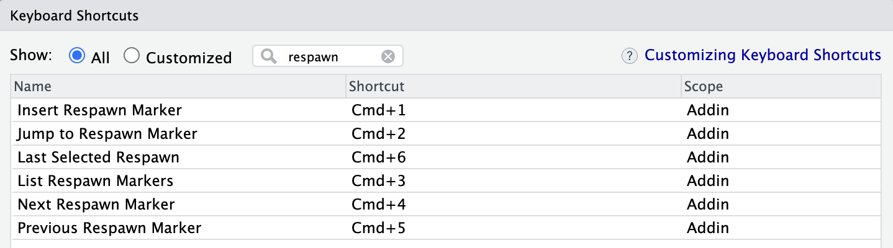

# respawnr

`respawnr` is a small RStudio addin package for long scripts. Drop marker
comments where you regularly need to return, bind the addins to keyboard
shortcuts, and jump without scrolling.

## Marker format

Use either style:

```r
# respawnr: imports
library(dplyr)

# @respawn model-fit
fit <- lm(mpg ~ wt, data = mtcars)
```

## Addins

After installing the package, RStudio will show these addins:

- **Insert Respawn Marker**: inserts `# respawnr: marker-name` at the cursor.
- **Jump to Respawn Marker**: opens a dropdown of markers ordered by line
  number and jumps to the selected marker. Long marker lists are scrollable.
  The last marker selected from this dropdown is marked with a red dot.
- **Next Respawn Marker**: jumps to the next marker after the cursor, wrapping
  to the first marker.
- **Previous Respawn Marker**: jumps to the previous marker before the cursor,
  wrapping to the last marker.
- **Last Selected Respawn**: jumps to the last marker selected from the dropdown.
- **List Respawn Markers**: prints markers and line numbers in the console.

Assign hotkeys in RStudio with **Tools > Modify Keyboard Shortcuts**, then search
for "Respawn". All addin names and exported navigation functions include
`respawn`, so they should be easy to find on macOS, Windows, and Linux.

Suggested shortcuts:

| Addin | macOS | Windows/Linux |
| --- | --- | --- |
| Insert Respawn Marker | `Cmd+1` | `Ctrl+1` |
| Jump to Respawn Marker | `Cmd+2` | `Ctrl+2` |
| List Respawn Markers | `Cmd+3` | `Ctrl+3` |
| Next Respawn Marker | `Cmd+4` | `Ctrl+4` |
| Previous Respawn Marker | `Cmd+5` | `Ctrl+5` |
| Last Selected Respawn | `Cmd+6` | `Ctrl+6` |

Example shortcut setup:



## Install locally

From GitHub:

```r
install.packages("remotes")
remotes::install_github("RichardTegtmeier/respawnr")
```

From a local checkout:

```r
install.packages("remotes")
remotes::install_local("respawnr")
```

For active development:

```r
install.packages("devtools")
devtools::load_all("respawnr")
```

## Customize marker syntax

Advanced users can override the marker regex:

```r
options(respawnr.marker_pattern = "^\\s*#\\s*JUMP\\s*:\\s*(.+?)\\s*$")
```
